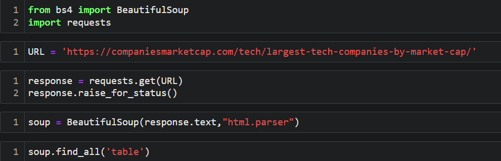
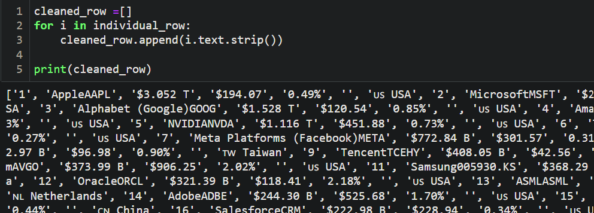
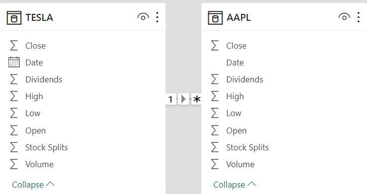
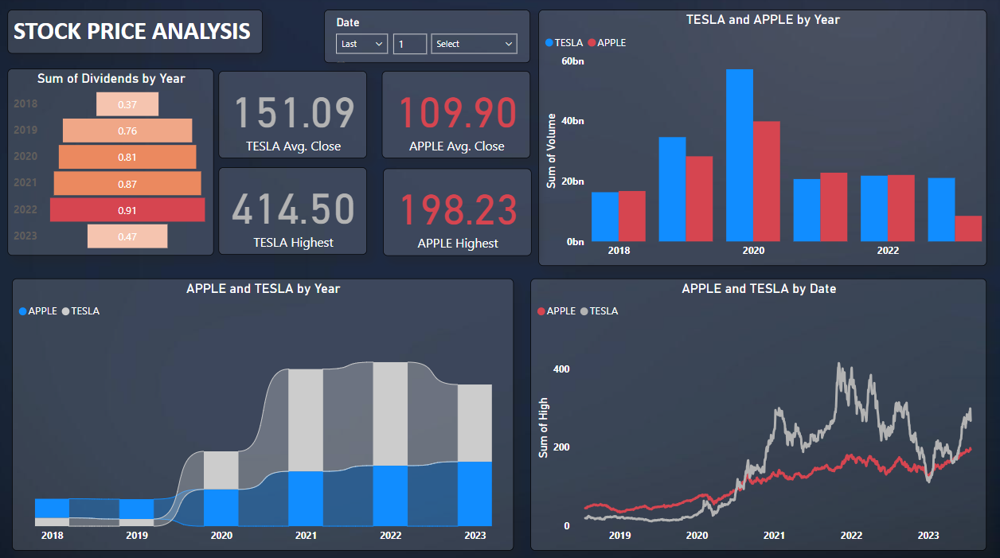

# Stock Market Analysis Project :chart_with_upwards_trend:

## Table of Contents :bookmark_tabs:

- [Description](#description-clipboard)
- [Technologies Used](#technologies-used-computer)
- [Installation](#installation-floppy_disk)
- [Data Scraping](#data-scraping)
- [Data Transformation and Cleaning](#data-transformation-and-cleaning-recycle)
- [Data Visualization](#data-visualization-bar_chart)
- [Dashboard in Power BI](#dashboard-in-power-bi-chart_with_downwards_trend)

## Description :clipboard:

This project is a Stock Market Analysis project that focuses on collecting stock data of the top 5 tech companies over the last 5 years. The project involves data scraping using Beautiful Soup and Yahoo Finance library, data transformation, cleaning, and saving it to CSV files. The data is then visualized and analyzed using Power BI to gain insights into the stock market trends and performance of the selected tech companies.

## Technologies Used :computer:

- Beautiful Soup
- Yahoo Finance Library
- Power BI
- Python
- Jupyter Notebook

## Installation :floppy_disk:

To run the project locally, follow these steps:

1. Clone the repository:
    https://github.com/Gurmancheema/Stock-Market-Analysis.git
2. Follow the [jupyter noteook](https://github.com/Gurmancheema/Stock-Market-Analysis/blob/main/Stock%20Market%20Data%20Acquisition%20by%20Web%20Scrapping.ipynb)
3. Install [PowerBI Desktop](https://powerbi.microsoft.com/en-ca/downloads/)
4. Open the [dashboard](https://github.com/Gurmancheema/Stock-Market-Analysis/blob/main/dashboard.pbix) file
5. Play with interactive dashboard & explore :smile:
## Data Scraping :mag_right:
- The data scraping process involves collecting historical stock data for the top 5 tech companies from Yahoo Finance using Beautiful Soup and the Yahoo Finance library.
- Since the trend is constantly changing, I used the data from a dynamic website. Everytime the project is run, it will scrape the latest data and the latest top 5 tech companies in terms of stock prices.
- Beautiful Soup is initially used to scrape the top 5 tech companies.
- Furthermore, the Yahoo Finance API comes into play to scrape the stock data for the companies scraped by Beautiful Soup.

  

## Data Transformation and Cleaning :recycle:

- Once the data is scraped, it undergoes a transformation and cleaning process to prepare it for analysis. This step includes handling missing data, filtering relevant columns, and converting the data into a suitable format.

  

  

## Data Visualization :bar_chart:

- For this project, I chose PowerBI visualisation tool to make an interactive and effective dashboard. Since the stock price data is time sensitive, certain functionalities like KPI cards, ribbon charts, funnnel chart etc. provide the insights in much detail and precise form.
- Power BI is used to create interactive visualizations that provide insights into the stock market trends and performance of the selected tech companies over the last 5 years.

  

## Dashboard in Power BI :chart_with_downwards_trend:

- The final outcome of the project is an informative dashboard in Power BI, presenting the analyzed data in an easy-to-understand format.

## Power BI Dashboard

  

License :scroll:
This project is licensed under the MIT License.
